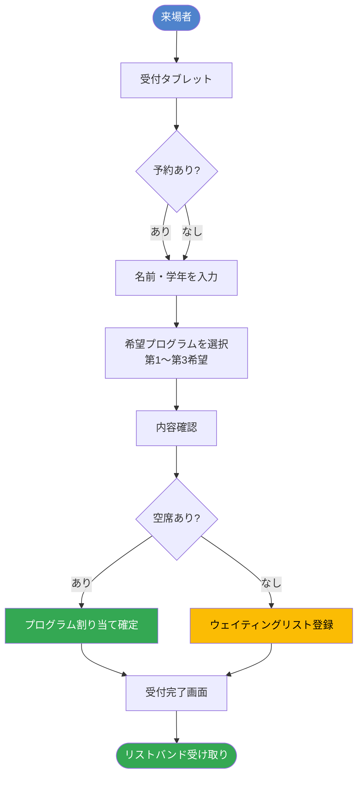
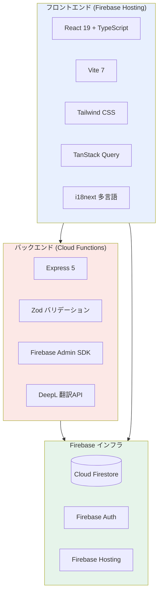
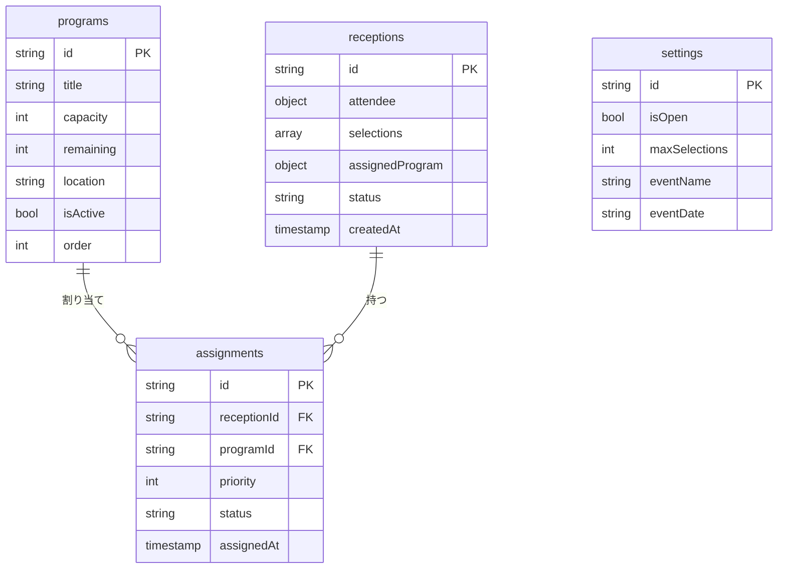
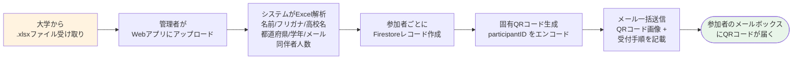
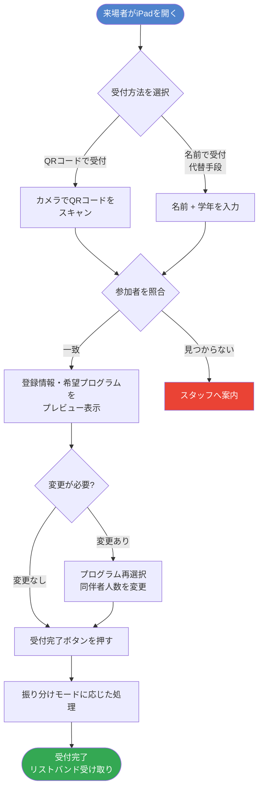
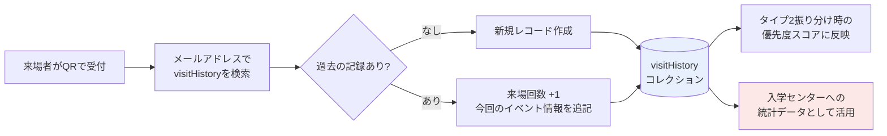
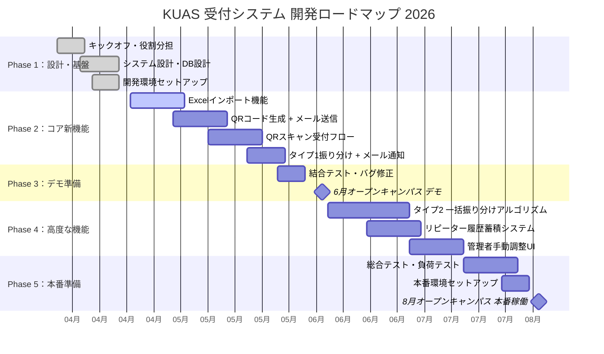
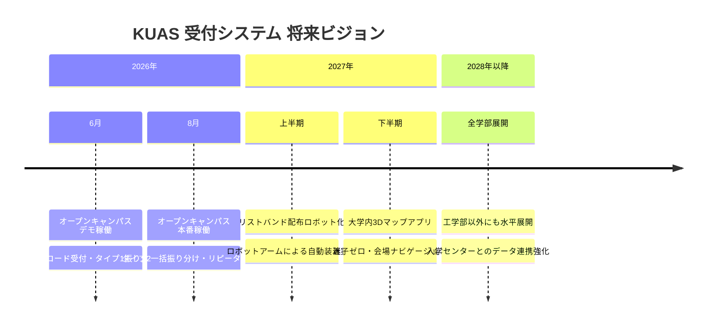

# KUAS 工学部オープンキャンパス受付システム
## コーナーストーンプロジェクト 計画書

---

**プロジェクト名：** スマート受付システム — QRコード × データ活用で変えるオープンキャンパス体験

| 項目 | 内容 |
|------|------|
| 申請区分 | コーナーストーンプロジェクト |
| 所属 | 京都先端科学大学 工学部 |
| メンバー | 5名 |
| 予算 | 25万円（5万円 × 5名） |
| 期間 | 2026年4月 〜 2026年8月 |
| 6月マイルストーン | オープンキャンパスにてデモ・試験運用 |
| 8月マイルストーン | オープンキャンパスにて本番稼働開始 |

---

## 1. エグゼクティブサマリー

本プロジェクトは、京都先端科学大学工学部が主催するオープンキャンパスの受付体験を、テクノロジーの力で根本から改善することを目的としています。現在すでに稼働中の Web 受付システム（v0.8.0）を基盤として、**Excelインポート → QRコード自動送信 → スマート受付 → 来場者データ蓄積** という一連のフローを新たに構築します。

この仕組みにより、当日の受付ミスや混雑を大幅に削減できるだけでなく、参加者のリピート状況などの貴重なデータを蓄積することで、今後のオープンキャンパス改善にも貢献します。工学部生が実際に稼働するシステムを設計・開発・運用するという経験は、エンジニアとしての実践的なスキルを身につける絶好の機会です。

---

## 2. 背景と課題

### 2.1 現状の受付フロー

```
来場者が受付ブースへ来る
  ↓
スタッフが名前・学年を口頭確認 or 入力
  ↓
参加者リストと照合（手動）
  ↓
プログラムを選んでもらう
  ↓
手書き or 口頭でリストバンド配布
```

### 2.2 現在の問題点

| # | 課題 | 影響 |
|---|------|------|
| 1 | **入力ミス・照合エラー** | 同姓同名、漢字の読み違いなどで照合に手間がかかる |
| 2 | **Excelリストの手動管理** | 大学から受け取ったリストを手で確認・転記している |
| 3 | **事後情報の未伝達** | 受付完了後、参加者へ会場や担当教員の情報を伝える手段がない |
| 4 | **リピーター情報の未蓄積** | 何度も来てくれている高校生のデータが残っていない |
| 5 | **全体受付での対応不可** | 現在は工学部専用受付での運用に限定されている |

> **目標：** 上記の課題をすべて解消し、iPadを1台置くだけで全体受付ブースでも対応できるシステムを構築する。

---

## 3. 現在のシステム概要（v0.8.0）

### 3.1 現在のシステムフロー



### 3.2 現在の実装済み機能

| カテゴリ | 機能 | 状態 |
|----------|------|------|
| **来場者受付** | 4ステップ受付フロー（情報入力→プログラム選択→確認→結果） | ✅ 実装済 |
| **来場者受付** | 先着順自動座席割り当て | ✅ 実装済 |
| **来場者受付** | ウェイティングリスト & 繰り上がり | ✅ 実装済 |
| **管理者** | リアルタイムKPIダッシュボード（総数・空席・受付済・待機中） | ✅ 実装済 |
| **管理者** | 手動座席割り当て・キャンセル | ✅ 実装済 |
| **管理者** | プログラムCRUD（作成・編集・削除・定員管理） | ✅ 実装済 |
| **管理者** | 受付開閉・イベント設定 | ✅ 実装済 |
| **システム** | Firestoreトランザクション（同時アクセス競合防止） | ✅ 実装済 |
| **システム** | 多言語対応（日本語・英語・インドネシア語） | ✅ 実装済 |
| **システム** | Firebase Authentication（管理者ログイン） | ✅ 実装済 |
| **システム** | GitHub Actions CI/CD 自動デプロイ | ✅ 実装済 |

### 3.3 技術スタック



### 3.4 データモデル（現在）



---

## 4. 新機能開発計画

### 4.1 機能①：Excelインポート → QRコード自動メール送信システム

> **最重要の新機能。** 大学から受け取った参加者名簿（.xlsx）をアップロードするだけで、全参加者にQRコード付きの受付案内メールが自動送信される。

#### フロー図



#### Excelファイルの列構成（想定）

| 列 | フィールド | 例 |
|----|-----------|-----|
| A | 氏名 | 山田 太郎 |
| B | フリガナ | ヤマダ タロウ |
| C | 高校名 | ○○高等学校 |
| D | 都道府県 | 京都府 |
| E | 学年 | 2年 |
| F | メールアドレス | yamada@example.com |
| G | 同伴者人数 | 1 |
| H | 希望プログラム① | AIロボット制作 |
| I | 希望プログラム② | スマートデバイス実験 |
| J | 希望プログラム③ | 橋梁設計シミュレーション |

#### 新規追加コレクション（Firestore）

```
participants/{participantId}
  ├── name: string          // 氏名
  ├── furigana: string      // フリガナ
  ├── school: string        // 高校名
  ├── prefecture: string    // 都道府県
  ├── grade: number         // 学年 (1/2/3)
  ├── email: string         // メールアドレス（visitHistoryのキー）
  ├── companions: number    // 同伴者人数
  ├── selections: string[]  // 希望プログラムID配列
  ├── qrCode: string        // QRコードデータURL
  ├── qrSentAt: timestamp   // メール送信日時
  └── eventId: string       // 対象イベントID
```

---

### 4.2 機能②：QRコードを使ったスマート受付フロー

> **受付ブースにiPadを1台置き、QRをかざすだけで受付完了。** 名前の入力ミスや照合の手間が完全になくなる。

#### メインフロー（QRコード使用）



---

### 4.3 機能③：2タイプの振り分けモード

> **タイプ1とタイプ2を管理者設定で切り替え可能。** イベントの方針に合わせて柔軟に選択できる。

#### タイプ比較表

| 項目 | タイプ1（先着順） | タイプ2（一括振り分け） |
|------|-----------------|----------------------|
| **確定タイミング** | 受付した瞬間に確定 | 全員受付後に一括確定 |
| **メール送信** | 受付完了直後に個別送信 | 振り分け後に一括送信 |
| **公平性** | 早く来た人が有利 | 学年・リピート・事前登録で優遇 |
| **向いている場面** | 少人数・シンプルな運営 | 参加者が多い・公平性を重視 |
| **手動調整** | キャンセル時のみ繰り上げ | 振り分け後に管理者が個別変更可 |

#### タイプ2 振り分けアルゴリズム


#### 受付後メール（タイプ1 / タイプ2共通）送信内容

```
件名：【KUAS オープンキャンパス】受付完了・プログラムのご案内

○○ 様

本日はご来場いただきありがとうございます。
受付が完了しました。以下のプログラムにご参加ください。

━━━━━━━━━━━━━━━━━━━━━━━
参加プログラム：AIロボット制作体験
担当教員      ：△△ 教授
会場          ：4号館 3階 301号室
開始時刻      ：14:00〜15:30
━━━━━━━━━━━━━━━━━━━━━━━

ご不明な点はスタッフまでお気軽にお声がけください。
```

---

### 4.4 機能④：リピーター来場履歴の蓄積

> **「何度も来てくれている高校生」のデータを蓄積する。** 入学センターにとっても価値の高いデータになる。



#### visitHistory コレクション（新規）

```
visitHistory/{email}
  ├── email: string              // メールアドレス（主キー）
  ├── name: string               // 最新の氏名
  ├── school: string             // 最新の高校名
  ├── totalVisits: number        // 累計来場回数
  └── visits: [
        {
          eventId: string        // イベントID
          eventName: string      // イベント名
          eventDate: date        // 開催日
          programId: string      // 参加プログラム
          grade: number          // 来場時の学年
          checkedInAt: timestamp // 受付時刻
        }
      ]
```

> **プライバシーへの配慮：** 受付フロー内に「来場履歴を記録することへの同意」チェックボックスを設け、同意した場合のみ蓄積します。

---

## 5. 開発スケジュール



---

## 6. チーム構成・役割分担

| 役割 | 担当範囲 | 主な使用技術 |
|------|----------|------------|
| **チームリーダー / フルスタック** | 全体設計・進捗管理・結合調整 | React, Node.js, Firebase |
| **フロントエンド担当** | UI/UX設計・受付画面・QRスキャナー | React, TypeScript, Tailwind |
| **バックエンド担当** | API設計・振り分けアルゴリズム・DB | Node.js, Express, Firestore |
| **インフラ・デプロイ担当** | Firebase設定・CI/CD・セキュリティ | Firebase, GitHub Actions |
| **UI/UX・ドキュメント担当** | デザイン統一・ドキュメント整備・テスト | Figma, Markdown, Jest |

---

## 7. 予算計画

| 項目 | 用途 | 予算（円） |
|------|------|----------|
| Firebase Blaze プラン | Cloud Functions・Firestore の本番運用費 | 10,000 |
| メール配信API（SendGrid） | QRコードメール一括送信 | 10,000 |
| テスト端末（iPad レンタル / 購入） | 受付ブースでの動作確認 | 50,000 |
| QRコードリーダー（追加分） | バックアップ端末用 | 20,000 |
| 開発ツール・ライセンス | デザインツール・有料ライブラリ等 | 10,000 |
| 予備費・リスク対応 | 予期せぬ出費への備え | 50,000 |
| チーム活動費 | ミーティング・印刷・交通費等 | 100,000 |
| **合計** | | **250,000** |

---

## 8. 期待される効果・価値

### 来場者への価値

| Before | After |
|--------|-------|
| 受付で名前を口頭 or 手入力 | QRをかざすだけで0秒受付 |
| 会場・担当教員を口頭で案内 | 受付後すぐにメールで案内が届く |
| どのプログラムに参加できるか当日まで不明 | 受付直後（タイプ1）または全員確定後（タイプ2）に即通知 |
| 毎回同じ情報を一から入力 | 事前登録で当日はQRのみ |

### 運営スタッフへの価値

- 受付ミス・照合エラーが**ほぼゼロ**になる
- 全体受付ブースでの工学部受付対応が可能になる（iPadを1台追加するだけ）
- 振り分け作業の自動化により、受付後の手作業が大幅減少

### 大学・入学センターへの価値

- **リピーター高校生のデータ**が自動蓄積 → どの高校のどの学年が何回来ているかが一目でわかる
- 参加者の地域・学年分布などの統計データを提供可能
- 将来的に全学部への展開も視野に、入学センターとの連携基盤となる

---

## 9. 将来のロードマップ



### 将来展望の詳細

#### リストバンド配布ロボット
受付完了後、カラーリストバンドをロボットアームが自動で装着するシステム。工学部らしい独自性のある取り組みとして、来場者へのインパクトも大きい。

#### 大学内3Dマップアプリ
オープンキャンパスでは「どこに行けばいいかわからない」という声が毎回上がる。スマートフォンで大学構内を3D表示し、「今どこにいて、次にどこへ行けばいいか」を直感的に案内するアプリを開発する。

#### 全学部展開
本システムが工学部で安定稼働した後、他学部のオープンキャンパスにも展開することで、KUAS全体の来場者体験向上に貢献する。

---

## 10. まとめ

本コーナーストーンプロジェクトは、以下の3点において非常に意義深いプロジェクトです。

1. **実用性**：実際に稼働し、毎年数百名が利用するシステムの開発・運用を経験できる
2. **技術的チャレンジ**：QRコード、メール配信、最適化アルゴリズムなど、実務で求められる技術を網羅
3. **社会貢献**：大学の入学センターに価値あるデータを提供し、来場者体験の向上に直接貢献する

ぜひご承認いただき、チーム一丸となって取り組んでまいります。どうぞよろしくお願いいたします。

---

*作成日：2026年4月　京都先端科学大学 工学部*
