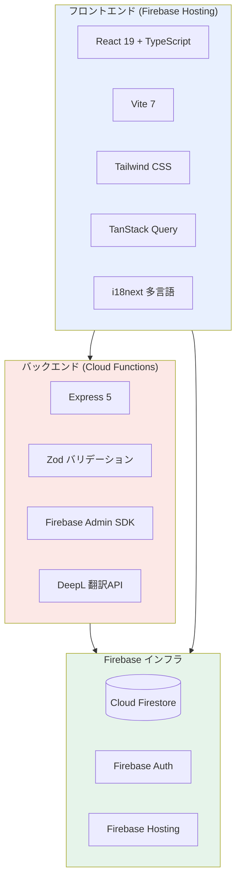
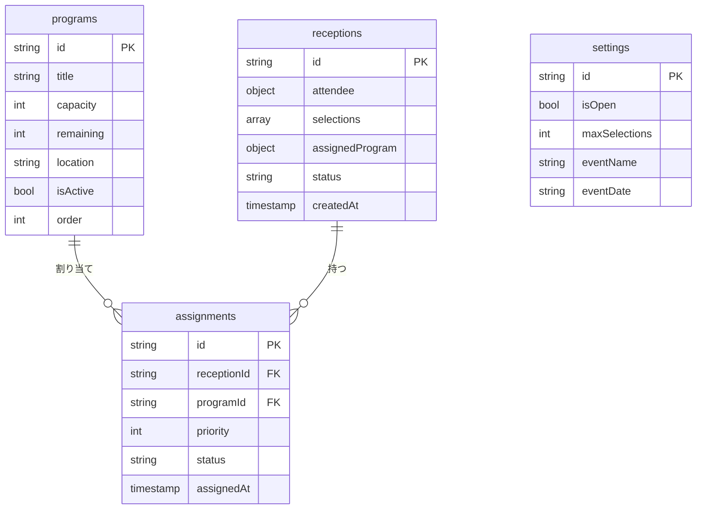
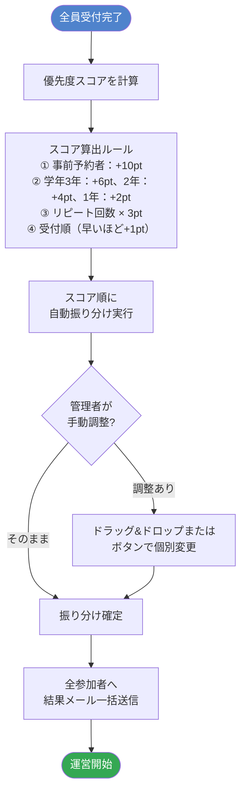
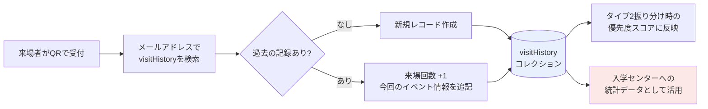
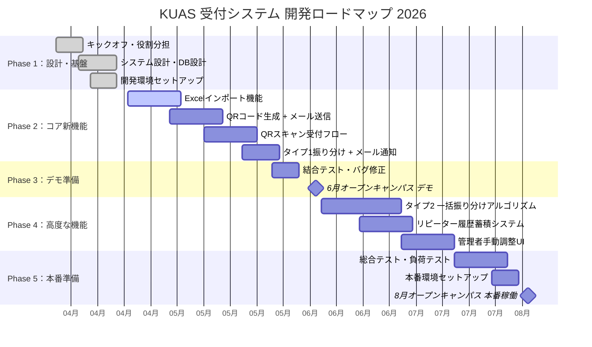
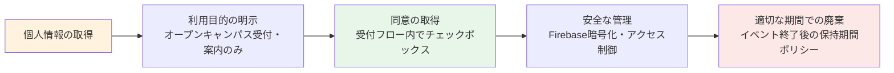
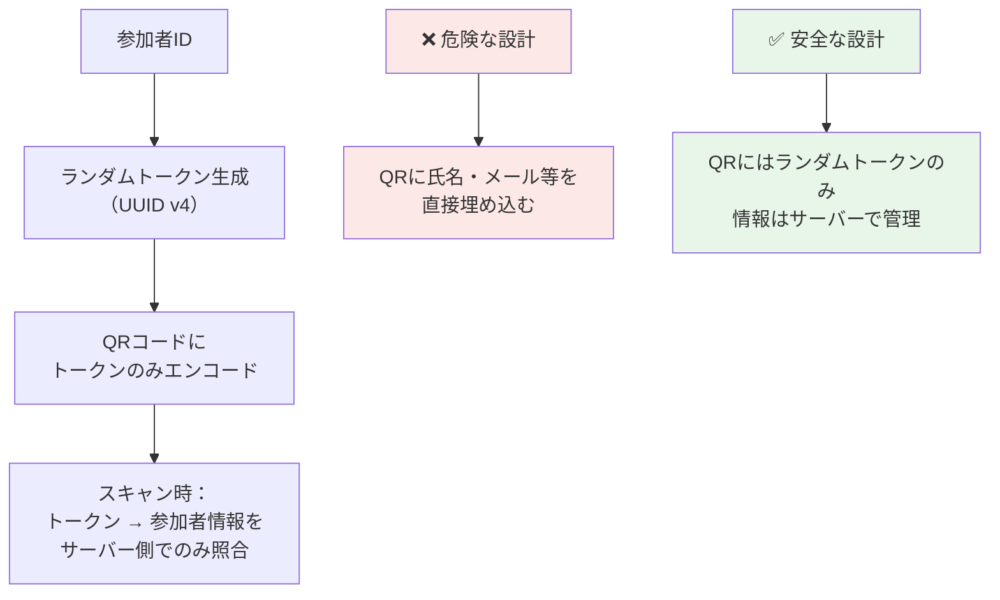
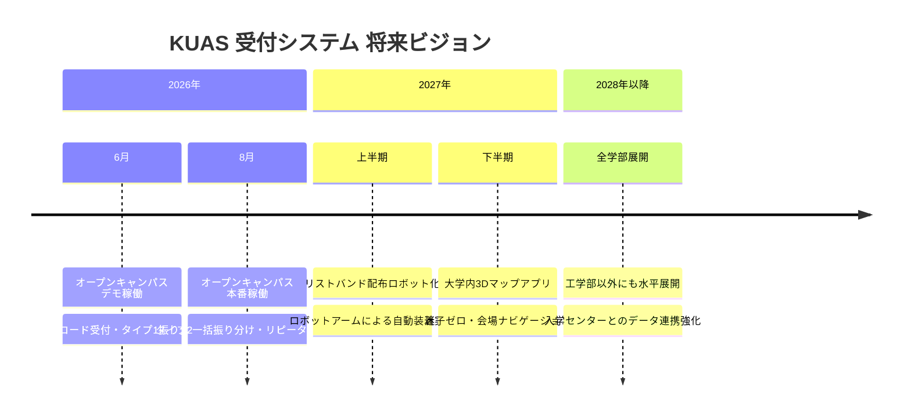

# KUAS 工学部オープンキャンパス受付システム
## コーナーストーンプロジェクト 計画書

---

**プロジェクト名：** スマート受付システム — QRコード × データ活用で変えるオープンキャンパス体験

| 項目 | 内容 |
|------|------|
| 申請区分 | コーナーストーンプロジェクト |
| 所属 | 京都先端科学大学 工学部 |
| メンバー | 5名 |
| 予算 | 25万円（5万円 × 5名） |
| 期間 | 2026年4月 〜 2026年8月 |
| 6月マイルストーン | オープンキャンパスにてデモ・試験運用 |
| 8月マイルストーン | オープンキャンパスにて本番稼働開始 |

---

## 1. エグゼクティブサマリー

本プロジェクトは、京都先端科学大学工学部が主催するオープンキャンパスの受付体験を、テクノロジーの力で根本から改善することを目的としています。現在制作段階にある Web 受付システムを基盤として、**Excelインポート → QRコード自動送信 → スマート受付 → 来場者データ蓄積** という一連のフローを新たに構築します。

この仕組みにより、当日の受付ミスや混雑を大幅に削減できるだけでなく、参加者のリピート状況などの貴重なデータを蓄積することで、今後のオープンキャンパス改善にも貢献します。工学部生が実際に稼働するシステムを設計・開発・運用するという経験は、エンジニアとしての実践的なスキルを身につける絶好の機会です。

**受付ブースの展開計画：** 6月は工学部専用受付ブースのiPad 1台でスタートし、8月には全体受付ブースに3〜4台のiPadを設置することを目指します。全体受付スタッフが「何学部ですか？」と声がけし、工学部の場合のみそのiPadで受付してもらう形にすることで、現在発生している「工学部生が全体受付と工学部受付の2回受付しなければならない」問題を解消できます。iPadの調達については、大学所有端末の貸与交渉・レンタル・購入の3つの方法を検討します。

---

## 2. 背景と課題

### 2.1 現状の受付フロー

```
来場者が受付ブースへ来る
  ↓
スタッフが名前・学年を口頭確認 or 入力
  ↓
参加者リストと照合（手動）
  ↓
プログラムを選んでもらう
  ↓
手書き or 口頭でリストバンド配布
```

### 2.2 現在の問題点

| # | 課題 | 影響 |
|---|------|------|
| 1 | **入力ミス・照合エラー** | 同姓同名、漢字の読み違いなどで照合に手間がかかる |
| 2 | **Excelリストの手動管理** | 大学から受け取ったリストを手で確認・転記している |
| 3 | **事後情報の未伝達** | 受付完了後、参加者へ会場や担当教員の情報を伝える手段がない |
| 4 | **リピーター情報の未蓄積** | 何度も来てくれている高校生のデータが残っていない |
| 5 | **全体受付での対応不可** | 現在は工学部専用受付での運用に限定されている |

> **目標：** 上記の課題をすべて解消し、iPadを1台置くだけで全体受付ブースでも対応できるシステムを構築する。

---

## 3. 現在のシステム概要（v0.8.0）

### 3.1 現在のシステムフロー


### 3.2 現在の実装済み機能

| カテゴリ | 機能 | 状態 |
|----------|------|------|
| **来場者受付** | 4ステップ受付フロー（情報入力→プログラム選択→確認→結果） | ✅ 実装済 |
| **来場者受付** | 先着順自動座席割り当て | ✅ 実装済 |
| **来場者受付** | ウェイティングリスト & 繰り上がり | ✅ 実装済 |
| **管理者** | リアルタイムKPIダッシュボード（総数・空席・受付済・待機中） | ✅ 実装済 |
| **管理者** | 手動座席割り当て・キャンセル | ✅ 実装済 |
| **管理者** | プログラムCRUD（作成・編集・削除・定員管理） | ✅ 実装済 |
| **管理者** | 受付開閉・イベント設定 | ✅ 実装済 |
| **システム** | Firestoreトランザクション（同時アクセス競合防止） | ✅ 実装済 |
| **システム** | 多言語対応（日本語・英語・インドネシア語） | ✅ 実装済 |
| **システム** | Firebase Authentication（管理者ログイン） | ✅ 実装済 |
| **システム** | GitHub Actions CI/CD 自動デプロイ | ✅ 実装済 |

### 3.3 技術スタック



### 3.4 データモデル（現在）



---

## 4. 新機能開発計画

### 4.1 機能①：Excelインポート → QRコード自動メール送信システム

> **最重要の新機能。** 大学から受け取った参加者名簿（.xlsx）をアップロードするだけで、全参加者にQRコード付きの受付案内メールが自動送信される。

#### フロー図


#### Excelファイルの列構成（実際の名簿）

大学から受け取る名簿は **2種類** に分かれており、両方を別々にインポートして統合管理します。

**① ミニキャップストーン体験 申込者名簿**

| 列 | フィールド | 備考 |
|----|-----------|------|
| No | 整理番号 | |
| 姓・名 | 氏名（分割） | |
| セイ・メイ | フリガナ（分割） | |
| 高校名 | 高校名 | |
| 高校名カナ | 高校名フリガナ | |
| 高校コード | 学校コード | |
| 都道府県 | 都道府県 | |
| 設置区分 | 公立・私立等 | |
| 学年 | 1〜3年 | |
| 性別 | 男・女 | |
| メールアドレス | QRコード送信先 | |
| 同伴者 | 同伴者人数 | |
| CS第一希望 | キャップストーン希望① | |
| CS第二希望 | キャップストーン希望② | |
| CS第三希望 | キャップストーン希望③ | |

**② 工学部紹介 申込者名簿**

| 列 | フィールド | 備考 |
|----|-----------|------|
| No | 整理番号 | |
| 時間 | 午前の部 / 午後の部 | ※詳細は下記 |
| 姓・名 | 氏名（分割） | |
| セイ・メイ | フリガナ（分割） | |
| 高校名 | 高校名 | |
| 高校名カナ | 高校名フリガナ | |
| 高校コード | 学校コード | |
| 都道府県 | 都道府県 | |
| 設置区分 | 公立・私立等 | |
| 学年 | 1〜3年 | |
| 性別 | 男・女 | |
| メールアドレス | QRコード送信先 | |
| 同伴者 | 同伴者人数 | |

> **「時間」フィールドの扱いについて：**
> 工学部紹介は **午前の部** と **午後の部** の2回開催されます。午前の部はミニキャップストーン体験と時間が重なるため、原則として同時受付はできません。午後の部はミニキャップストーン体験の後に設定されているため、併願可能です。
> ただし、午前の部を予約していた方が当日「やっぱりミニキャップストーン体験をしたい」とご希望の場合は、体験を優先し、その後の工学部紹介（午後の部）に案内する柔軟対応も可能とします。

> **両名簿の関係：** 両方に申し込んでいる方もいれば、どちらか一方のみの方もいます。メールアドレスをキーとして名簿を統合し、1人の参加者として管理します。

#### 名簿にない参加者への対応

```
事前登録したが締め切り直後で名簿（Excel）に反映されていないケース
  ↓
QRスキャン・名前検索 → 見つからない
  ↓
「名簿に見つかりません」と表示
  ↓
その場で新規受付として登録（情報を手入力）
  ↓
通常の受付フローへ合流
```

> 締め切り後の申込者や当日飛び込み参加者も、新規受付として漏れなく対応できます。

#### 新規追加コレクション（Firestore）

```
participants/{participantId}
  ├── name: string          // 氏名
  ├── furigana: string      // フリガナ
  ├── school: string        // 高校名
  ├── prefecture: string    // 都道府県
  ├── grade: number         // 学年 (1/2/3)
  ├── email: string         // メールアドレス（visitHistoryのキー）
  ├── companions: number    // 同伴者人数
  ├── selections: string[]  // 希望プログラムID配列
  ├── qrCode: string        // QRコードデータURL
  ├── qrSentAt: timestamp   // メール送信日時
  └── eventId: string       // 対象イベントID
```

---

### 4.2 機能②：QRコードを使ったスマート受付フロー

> **受付ブースにiPadを1台置き、QRをかざすだけで受付完了。** 名前の入力ミスや照合の手間が完全になくなる。

#### メインフロー（QRコード使用）


---

### 4.3 機能③：2タイプの振り分けモード

> **タイプ1とタイプ2を管理者設定で切り替え可能。** イベントの方針に合わせて柔軟に選択できる。

#### タイプ比較表

| 項目 | タイプ1（先着順） | タイプ2（一括振り分け） |
|------|-----------------|----------------------|
| **確定タイミング** | 受付した瞬間に確定 | 全員受付後に一括確定 |
| **メール送信** | 受付完了直後に個別送信 | 振り分け後に一括送信 |
| **公平性** | 早く来た人が有利 | 学年・リピート・事前登録で優遇 |
| **向いている場面** | 少人数・シンプルな運営 | 参加者が多い・公平性を重視 |
| **手動調整** | キャンセル時のみ繰り上げ | 振り分け後に管理者が個別変更可 |

#### タイプ2 振り分けアルゴリズム



#### 受付後メール（タイプ1 / タイプ2共通）送信内容

```
件名：【KUAS オープンキャンパス】受付完了・プログラムのご案内

○○ 様

本日はご来場いただきありがとうございます。
受付が完了しました。以下のプログラムにご参加ください。

━━━━━━━━━━━━━━━━━━━━━━━
参加プログラム：AIロボット制作体験
担当教員      ：△△ 教授
会場          ：4号館 3階 301号室
開始時刻      ：14:00〜15:30
━━━━━━━━━━━━━━━━━━━━━━━

ご不明な点はスタッフまでお気軽にお声がけください。
```

---

### 4.4 機能④：リピーター来場履歴の蓄積

> **「何度も来てくれている高校生」のデータを蓄積する。** 入学センターにとっても価値の高いデータになる。



#### visitHistory コレクション（新規）

```
visitHistory/{email}
  ├── email: string              // メールアドレス（主キー）
  ├── name: string               // 最新の氏名
  ├── school: string             // 最新の高校名
  ├── totalVisits: number        // 累計来場回数
  └── visits: [
        {
          eventId: string        // イベントID
          eventName: string      // イベント名
          eventDate: date        // 開催日
          programId: string      // 参加プログラム
          grade: number          // 来場時の学年
          checkedInAt: timestamp // 受付時刻
        }
      ]
```

> **プライバシーへの配慮：** 受付フロー内に「来場履歴を記録することへの同意」チェックボックスを設け、同意した場合のみ蓄積します。

---

## 5. 開発スケジュール



---

## 6. チーム構成・役割分担

| 役割 | 担当範囲 | 主な使用技術 |
|------|----------|------------|
| **チームリーダー / フルスタック** | 全体設計・進捗管理・結合調整 | React, Node.js, Firebase |
| **フロントエンド担当** | UI/UX設計・受付画面・QRスキャナー | React, TypeScript, Tailwind |
| **バックエンド担当** | API設計・振り分けアルゴリズム・DB | Node.js, Express, Firestore |
| **インフラ・デプロイ担当** | Firebase設定・CI/CD・セキュリティ | Firebase, GitHub Actions |
| **UI/UX・ドキュメント担当** | デザイン統一・ドキュメント整備・テスト | Figma, Markdown, Jest |

---

## 7. 予算計画

| 項目 | 用途 | 予算（円） |
|------|------|----------|
| Firebase Blaze プラン | Cloud Functions・Firestore の本番運用費 | 10,000 |
| メール配信API（SendGrid） | QRコードメール一括送信 | 10,000 |
| テスト端末（iPad レンタル / 購入） | 受付ブースでの動作確認 | 50,000 |
| QRコードリーダー（追加分） | バックアップ端末用 | 20,000 |
| 開発ツール・ライセンス | デザインツール・有料ライブラリ等 | 10,000 |
| 予備費・リスク対応 | 予期せぬ出費への備え | 50,000 |
| チーム活動費 | ミーティング・印刷・交通費等 | 100,000 |
| **合計** | | **250,000** |

---

## 8. 期待される効果・価値

### 来場者への価値

| Before | After |
|--------|-------|
| 受付で名前を口頭 or 手入力 | QRをかざすだけで0秒受付 |
| 会場・担当教員を口頭で案内 | 受付後すぐにメールで案内が届く |
| どのプログラムに参加できるか当日まで不明 | 受付直後（タイプ1）または全員確定後（タイプ2）に即通知 |
| 毎回同じ情報を一から入力 | 事前登録で当日はQRのみ |

### 運営スタッフへの価値

- 受付ミス・照合エラーが**ほぼゼロ**になる
- 全体受付ブースでの工学部受付対応が可能になる（iPadを1台追加するだけ）
- 振り分け作業の自動化により、受付後の手作業が大幅減少

### 大学・入学センターへの価値

- **リピーター高校生のデータ**が自動蓄積 → どの高校のどの学年が何回来ているかが一目でわかる
- 参加者の地域・学年分布などの統計データを提供可能
- 将来的に全学部への展開も視野に、入学センターとの連携基盤となる

---

## 9. セキュリティ設計・個人情報保護

> 本システムは高校生を含む外部の個人情報を取り扱うため、セキュリティと個人情報保護を設計の最優先事項と位置づけています。

### 9.1 取り扱う個人情報の種類と範囲

| 情報 | 取得元 | 用途 | 感度 |
|------|--------|------|------|
| 氏名（姓・名・フリガナ） | Excelインポート / 当日入力 | 受付照合・メール宛名 | 中 |
| 高校名・都道府県・設置区分 | Excelインポート | 入学センター分析 | 低 |
| 学年・性別 | Excelインポート | 振り分け優先度 | 低 |
| **メールアドレス** | Excelインポート | QRコード送信・来場履歴のキー | **高** |
| 同伴者人数 | Excelインポート / 当日入力 | 席数計算 | 低 |
| **来場履歴（参加回数・参加プログラム）** | システム蓄積 | 優先度スコア・分析 | **高** |

> **特記事項：** 参加者は高校生（未成年者）を含みます。個人情報保護法および大学の個人情報保護方針に準拠した厳格な管理を行います。

---

### 9.2 法的根拠・コンプライアンス



- **個人情報保護法（日本）** に基づき、利用目的を受付フロー内に明示します
- 来場履歴の蓄積については、**受付時に明示的な同意チェックボックス**を設け、同意した参加者のみ記録します
- 取得した個人情報は **オープンキャンパスの受付・案内・運営改善** 以外の目的には使用しません
- データ管理責任者（担当教員・入学センター）と連携し、適切な保持期間を定めます

---

### 9.3 現在実装済みのセキュリティ対策

#### 多層防御アーキテクチャ

```
インターネット
    │
    ▼
┌───────────────────────────────────────┐
│  Layer 1：通信の暗号化                │
│  HTTPS / TLS 1.3（Firebase Hosting    │
│  が自動で証明書管理・強制リダイレクト） │
└──────────────────┬────────────────────┘
                   │
                   ▼
┌───────────────────────────────────────┐
│  Layer 2：管理者認証                  │
│  Firebase Authentication              │
│  メール+パスワード認証。管理者以外は   │
│  ダッシュボードに一切アクセス不可。    │
└──────────────────┬────────────────────┘
                   │
                   ▼
┌───────────────────────────────────────┐
│  Layer 3：API レベル認証              │
│  Bearer Token（Firebase ID Token）    │
│  管理者専用エンドポイントは全てトークン│
│  検証必須。期限切れ・改ざんは自動拒否。│
└──────────────────┬────────────────────┘
                   │
                   ▼
┌───────────────────────────────────────┐
│  Layer 4：データベースアクセス制御     │
│  Firestore Security Rules             │
│  コレクション単位で読み書き権限を定義。 │
│  receptions・assignments は認証ユーザー│
│  のみ参照可能。                        │
└──────────────────┬────────────────────┘
                   │
                   ▼
┌───────────────────────────────────────┐
│  Layer 5：入力データの検証            │
│  Zod スキーマバリデーション           │
│  フロントエンド・バックエンドの両方で  │
│  型・範囲・形式を厳密に検証。          │
│  SQLインジェクション等の攻撃を無効化。 │
└───────────────────────────────────────┘
```

#### Firestore セキュリティルールの概要

| コレクション | 一般ユーザー | 認証済みユーザー（管理者） |
|-------------|-------------|------------------------|
| `programs` | 読み取り ✅ | 読み書き ✅ |
| `receptions` | 書き込み（新規作成）✅ | 読み書き（全件）✅ |
| `assignments` | アクセス不可 ✗ | 読み書き ✅ |
| `settings` | 読み取り ✅ | 読み書き ✅ |
| `participants`（予定） | アクセス不可 ✗ | 読み書き ✅ |
| `visitHistory`（予定） | アクセス不可 ✗ | 読み書き ✅ |

---

### 9.4 新機能追加時のセキュリティ設計

#### QRコードのセキュリティ



- QRコードには **氏名・メールアドレス等の個人情報を直接含めません**
- QRコード内はランダムな UUID（例：`a3f9-bc12-...`）のみをエンコード
- スキャン時はサーバーがトークンで検索し、情報を返す設計のため、QRを第三者が盗み見ても個人情報は露出しません
- スキャン済みフラグを設定し、同一QRコードの二重受付を防止します

#### Excel ファイル処理のセキュリティ

| リスク | 対策 |
|--------|------|
| 悪意あるExcelマクロ | サーバーサイドで処理し、マクロは一切実行しない |
| ファイルサイズ攻撃（DoS） | アップロードサイズ上限を設定（例：5MB） |
| 不正なファイル形式 | MIMEタイプ・拡張子・ファイルシグネチャを検証 |
| インジェクション攻撃 | セルの値はZodで型・形式を厳密に検証してから保存 |
| 誤ったファイルのアップロード | アップロード前にプレビュー画面を表示し、管理者が確認 |

#### メール送信のセキュリティ

- **SendGrid**（業界標準のメール配信サービス）を使用し、セキュアなAPIキーで認証
- **SPF・DKIM・DMARC** の設定により、なりすまし送信を防止
- メール本文には **パスワードや秘密情報を含めません**（QRトークンのみ）
- メール送信はサーバーサイド（Cloud Functions）のみで実行し、フロントエンドから直接送信しません

#### 来場履歴データの保護

- メールアドレスをキーとして使用する際、Firestore上では **メールアドレスをそのまま保存**しますが、アクセスは管理者認証済みユーザーのみに限定
- 将来的なスケール時にはハッシュ化（SHA-256）も検討します

---

### 9.5 データ保管場所・暗号化

| 項目 | 内容 |
|------|------|
| **データ保管場所** | Google Cloud（asia-northeast1 リージョン：日本国内） |
| **保存時の暗号化** | Firebase / Google Cloud が自動で AES-256 暗号化 |
| **通信時の暗号化** | HTTPS / TLS 1.3（全通信で強制） |
| **バックアップ** | Firestore が自動でデータをレプリケーション・冗長化 |
| **データへのアクセス** | Google の認証済みインフラエンジニアのみ（運用上の必要がある場合） |

> データは**日本国内のサーバー**に保管されます。海外へのデータ転送は発生しません。

---

### 9.6 セキュリティリスク評価

| リスク | 発生可能性 | 影響度 | 対策 |
|--------|-----------|--------|------|
| QRコードの盗撮・不正使用 | 低 | 中 | ランダムトークン方式・スキャン済みフラグ |
| 管理者アカウントの不正ログイン | 低 | 高 | Firebase Auth（強力なパスワード必須）|
| 個人情報の漏洩 | 極低 | 高 | 多層アクセス制御・Firestore Rules |
| Excelファイルの悪意あるコード | 低 | 中 | サーバーサイド処理・バリデーション |
| API への不正リクエスト（スパム） | 中 | 低 | バリデーション・将来的にレート制限追加 |
| 同一QRの二重受付 | 低 | 低 | スキャン済みフラグ |

---

### 9.7 セキュリティ対策ロードマップ

| フェーズ | 対応内容 |
|---------|----------|
| **開発中（現在）** | Firestore Rules 強化・Zod バリデーション・HTTPS強制 |
| **6月デモまで** | QRトークン設計・Excel アップロードバリデーション・メール送信セキュリティ設定 |
| **8月本番まで** | レート制限の追加・セキュリティルール最終レビュー・同意フロー実装 |
| **本番稼働後** | 定期的なセキュリティルールレビュー・ログ監査・データ保持期間管理 |

---

## 10. 将来のロードマップ



### 将来展望の詳細

#### リストバンド配布ロボット
受付完了後、カラーリストバンドをロボットアームが自動で装着するシステム。工学部らしい独自性のある取り組みとして、来場者へのインパクトも大きい。

#### 大学内3Dマップアプリ
オープンキャンパスでは「どこに行けばいいかわからない」という声が毎回上がる。スマートフォンで大学構内を3D表示し、「今どこにいて、次にどこへ行けばいいか」を直感的に案内するアプリを開発する。

#### 全学部展開
本システムが工学部で安定稼働した後、他学部のオープンキャンパスにも展開することで、KUAS全体の来場者体験向上に貢献する。

---

## 11. まとめ

本コーナーストーンプロジェクトは、以下の4点において非常に意義深いプロジェクトです。

1. **実用性**：実際に稼働し、毎年数百名が利用するシステムの開発・運用を経験できる
2. **技術的チャレンジ**：QRコード、メール配信、最適化アルゴリズムなど、実務で求められる技術を網羅
3. **社会貢献**：大学の入学センターに価値あるデータを提供し、来場者体験の向上に直接貢献する
4. **セキュリティ意識**：外部の個人情報（未成年を含む高校生）を安全に扱うシステムを設計・運用することで、実務に直結したセキュリティ設計の経験を積む

ぜひご承認いただき、チーム一丸となって取り組んでまいります。どうぞよろしくお願いいたします。

---

*作成日：2026年4月　京都先端科学大学 工学部*
